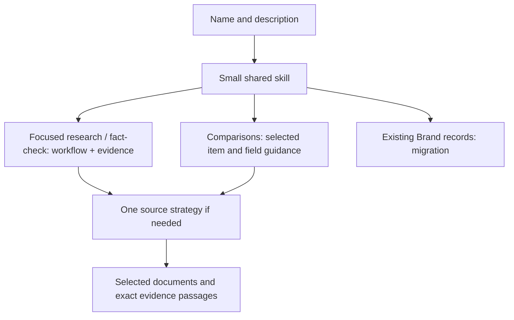

# Harness Research

Research topics, compare options and fact-check claims with Codex, Claude Code,
Cursor or another coding agent. Supply a question, source documents or an
existing research project. The AI plans the work and records cited findings;
you do not need to write JSON or design an outline.

## Install

Node.js 20+ is required. The core workflow has no runtime npm/Python dependencies,
model subscriptions or account setup.

```sh
git clone https://github.com/dbbaskette/harness-research-skill.git
cd harness-research-skill
bash scripts/Install-Harness-Research.sh --dry-run
bash scripts/Install-Harness-Research.sh
```

One local package serves all three harnesses. Start a new session and invoke
`harness-research` (Codex: `$harness-research`; Claude Code: `/harness-research`).
Existing independent skills are preserved. The installer migrates only discovery
links belonging to the former Tanzu Brand research bundle; new users get one
entrypoint. Optional comparative field validation needs project-local Python/
PyYAML, prepared only when used.

> Research this launch using only the attached documents. Show evidence gaps.
>
> Compare these platforms using supplied material and public primary sources.
>
> Fact-check these claims, retain contradictions, and continue the saved report.

## What it preserves

- Supplied-only or combined source scope; private material stays local.
- Readable document snapshots, exact source passages, citations and revisions.
- Automatic Markdown reports, unresolved questions, contradictions and extraction gaps.
- Resume, source-change detection, Unicode claim offsets, history and serial-save locks.
- Existing comparative item/field outlines and the adapted upstream researcher resources.

The helpers store evidence; the current agent's tools perform searches and judge
support. Hashes do not prove that a live source is current or a claim is true.
Tanzu Brand invokes this skill for approved research and consumes its report;
it no longer bundles or runs its own research engine.

## Commands

Run these from the installed skill or checkout. The agent prepares input files.

| Command | Purpose |
| --- | --- |
| `node scripts/harness-research.mjs plan --project DIR --file plan.json` | Save/resume questions; write the report |
| `... record --project DIR --run ID --item ID --file finding.json` | Record an inspected finding; refresh report |
| `... status --project DIR` | Show pending, unresolved and stale evidence |
| `... migrate --project DIR` | Copy older `.tanzu-research` records without changing originals |
| `bash scripts/Install-Harness-Research.sh --dry-run` | Preview installation/migration |

New reports live in `.harness-research/research-report.md` under the content
project. [Migration](references/migration.md) explains older records and aliases.

## Progressive disclosure



<!-- CONTEXT-USAGE:START -->
Measured with `cl100k_base`; cumulative whole-file instruction counts.

| Reading path | Tokens |
| --- | ---: |
| Discovery metadata | 39 |
| Activated entrypoint | 446 |
| Focused research / fact-check with saved report | 2,012 |
| Comparative workflow routing | 960 |
| Legacy migration | 686 |

One source strategy, selected comparative resources and evidence add conditional
context. The complete upstream bundle is never a default loading path.
<!-- CONTEXT-USAGE:END -->

Counts cover instruction loading, not documents, images or tool responses.
Scripts and archived upstream resources do not automatically enter context.
Run `npm run context:update` after guidance changes; `context:check` catches drift.

## Provenance and verification

This extracts Tanzu Brand's custom engine and its pinned modified
[Deep-Research-skills](https://github.com/dbbaskette/Deep-Research-skills) bundle.
[NOTICE](NOTICE.md) records origin, license and adaptations. The root skill is
harness-neutral; retained platform resources support optional comparisons and
legacy aliases. No private brand assets are included.

`npm test` checks evidence, resume, privacy boundaries, migration and installation.
`npm run ci:local` uses the existing Tart/macOS test suite in a disposable clone.
Tests use local synthetic documents, not real accounts or research services.
See [extraction and verification](docs/extraction.md).
